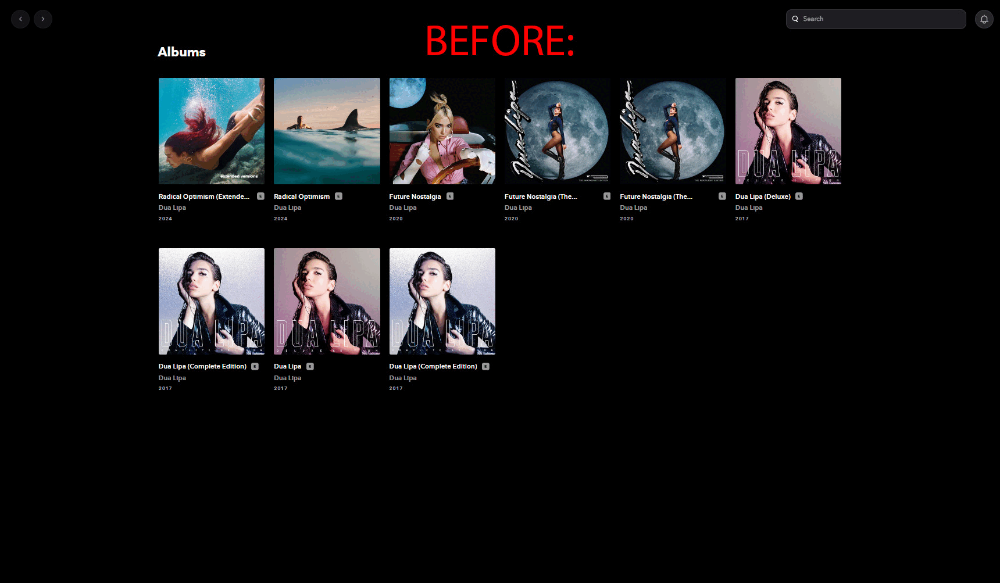

# Tidal More Albums

By default, Tidal hides the `HIGH` and `Dolby Atmos` versions if `MAX` versions are available. With this script, you can view them all and show all releases in artists' discographies. It's for the Web Player only.

## Installing

Install [the script](https://github.com/pawllo01/tidal-more-albums/raw/main/tidal-more-albums.user.js) using [Tampermonkey](https://chromewebstore.google.com/detail/tampermonkey/dhdgffkkebhmkfjojejmpbldmpobfkfo) or another userscript manager.

If you're using Tampermonkey, make sure to enable Developer Mode. - [tutorial](https://www.tampermonkey.net/faq.php?locale=en#Q209)
